# Houdini Synthetic Data Generation Pipeline

> Procedural synthetic data generation for instance segmentation and object detection, built in SideFX Houdini.

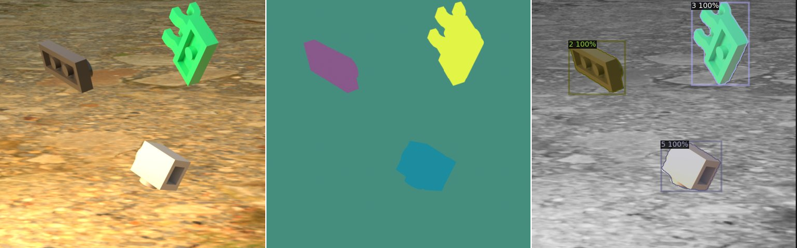

---

## Overview

This project is an end-to-end procedural synthetic data generation pipeline for Lego brick instance segmentation and object detection. It was built in SideFX Houdini across SOPs, Solaris, and TOPs/PDG and is designed to produce COCO-format datasets without any manually annotated training data. The pipeline renders scenes using Karma XPU and extracts pixel-perfect annotations automatically via Cryptomatte AOVs, eliminating the annotation bottleneck that makes large-scale manual labeling impractical for small teams with limited resources. Domain randomization across 32 axes drives sim-to-real transfer, covering lighting, materials, camera pose, object placement, occlusion, background texture, and more. A Mask R-CNN with ResNet-50-FPN backbone was initialized from COCO pretraining and fine-tuned exclusively on pipeline output. The model was then evaluated against two real-world photograph datasets (Controlled, n=30; Diverse, n=60), with evaluation ground truth produced via SAM 3-assisted annotation with manual correction in CVAT, achieving AP@50 of 94.0% on bbox and 95.1% on segmentation under diverse, uncontrolled conditions in the single-class baseline. The project follows a full iterative research loop: failure mode analysis on real-world evaluation results drove targeted pipeline interventions including distractor objects, occlusion augmentation, and 13 additional background textures, followed by scale-up to 7,000 images across 7 geometrically distinct part classes.

---

## Assets

### Lego parts

Source geometry for all training scenes comes from [LDraw](https://www.ldraw.org), an open standard for Lego CAD models with a community-maintained library of over 18,000 official parts. LDraw `.dat` files define precise geometry for each part, which are imported into Houdini SOPs and used as the objects to be detected and segmented.

Seven geometrically distinct parts were selected to cover a range of shapes, sizes, and visual complexity:

<table>
  <tr>
    <td align="center">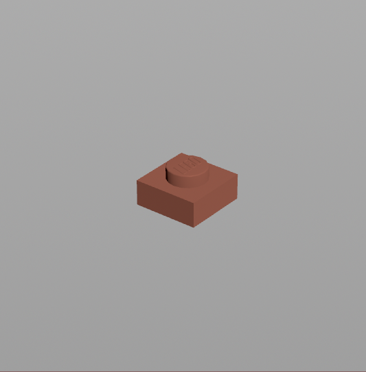 1x1 plate</td>
    <td align="center">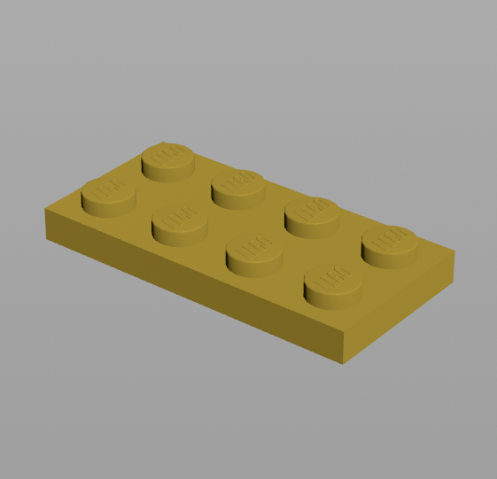 2x4 plate</td>
    <td align="center">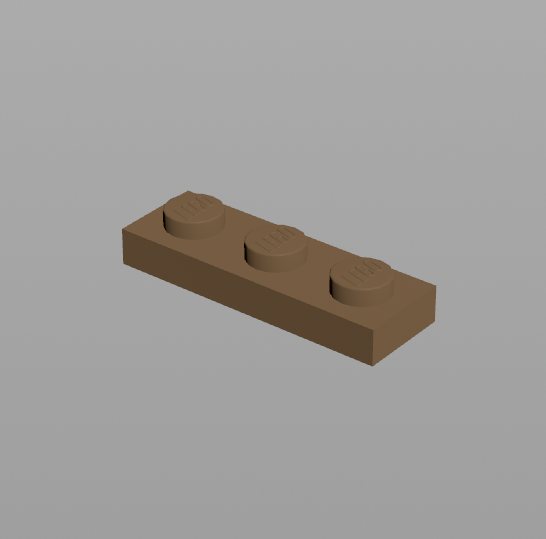 1x3 plate</td>
    <td align="center">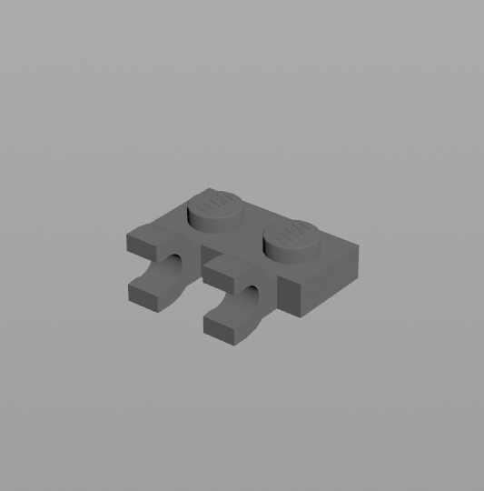 1x2 plate with 2 U-clips</td>
  </tr>
  <tr>
    <td align="center">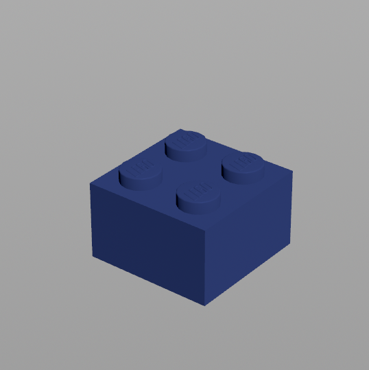 2x2 brick</td>
    <td align="center">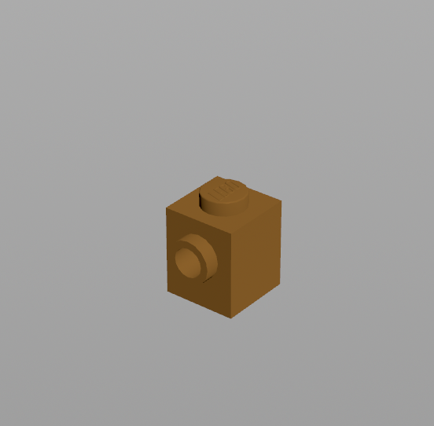 1x1 brick with stud on side</td>
    <td align="center">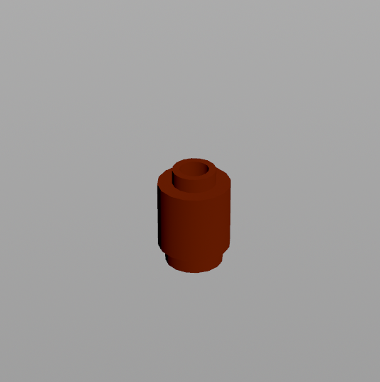 1x1 round brick</td>
    <td></td>
  </tr>
</table>

These parts were chosen to create a challenging classification problem: several share similar silhouettes from certain viewpoints (1x3 plate vs 2x4 plate, 1x1 plate vs 1x1 brick with stud on side), directly testing the model's ability to learn fine-grained geometric distinctions from synthetic data alone.

---

### Textures

Ground and backdrop textures were sourced from two libraries:

- [Poly Haven](https://polyhaven.com) - PBR texture sets (albedo, roughness, normal, displacement maps)
- [ambientCG](https://ambientcg.com) - additional PBR texture sets

The texture library covers 30 surface types spanning wood, concrete, tile, fabric, metal, gravel, and coarse outdoor surfaces. 13 additional textures (rough concrete, gravel, coarse stone, and reflective metals) were added in v2 specifically to address false positive failure modes identified in v1 evaluation.

---

### HDRIs

All HDRIs were sourced from [Poly Haven](https://polyhaven.com). 35 HDRIs are used across four categories, weighted toward indoor environments to match the most common real-world use case:

| Category | Count | Description |
|----------|:-----:|-------------|
| Studio / workshop | 8 | Controlled, clean lighting with varied directionality |
| Living spaces | 7 | Kitchen, living room, dining room, bedroom (varied window size and direction) |
| Commercial / other indoor | 5 | Office, warehouse, museum (unusual color casts and lighting patterns) |
| Sunny / clear sky | 4 | Strong directional shadows, blue fill |
| Overcast / cloudy | 4 | Soft diffuse light, muted shadows |
| Golden hour / sunset | 2 | Warm dramatic color cast, extreme white balance |
| Night / dim | 2 | Low light, artificial light sources |
| Mixed lighting | 2 | Multiple color temperatures simultaneously |
| High contrast | 1 | Very bright and very dark regions in the same scene |
| **Total** | **35** | |

HDRI selection was informed by Tremblay et al. (2018), which identifies lighting variety as the single highest-impact domain randomization axis for sim-to-real transfer. The distribution skews indoor (57%) to match the most common conditions in the diverse evaluation set.

One known distribution gap: the current HDRI library skews toward higher-exposure environments, resulting in fewer truly dark or low-light training scenes. The night/dim category (2 HDRIs) is underrepresented relative to real-world conditions. A future iteration will rebalance the distribution toward lower-exposure environments to improve generalization under dim lighting.

---

## Pipeline Architecture

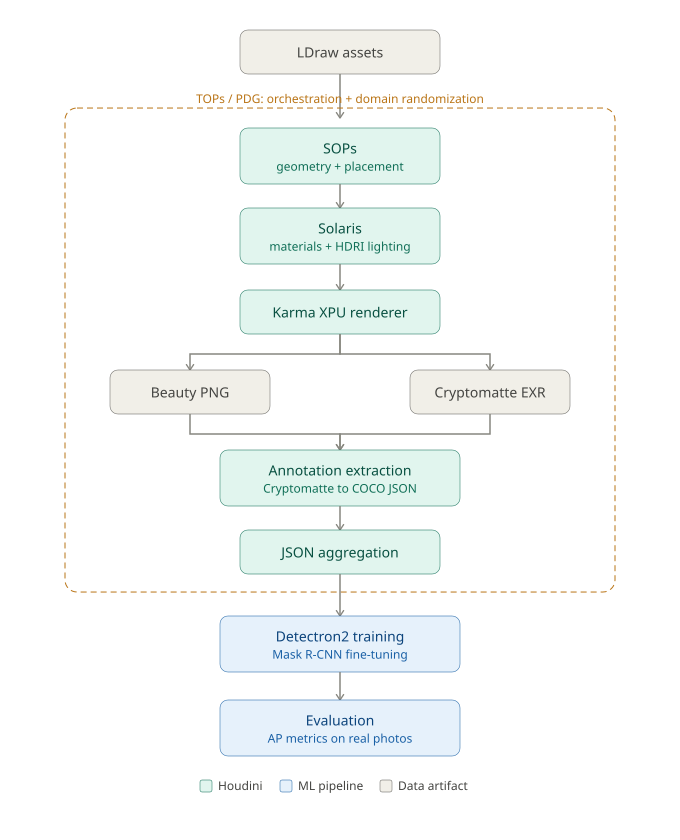

---

## Technical Highlights

- **Renderer:** Karma XPU (Solaris)
- **Scene Assembly:** Houdini SOPs (geometry, object placement, intersection avoidance)
- **Task Orchestration:** Houdini TOPs/PDG (batch generation, wedging, parallel task execution)
- **Annotation Extraction:** Cryptomatte AOV-based extraction (OpenEXR, NumPy, OpenCV)
- **Output Format:** COCO JSON (bounding boxes + instance segmentation masks)
- **Domain Randomization Axes:** 32
- **Dataset Scale:** 1,000 images (v1 and v2) → 3,000 images (v3) → 7,000 images (v4)
- **Classes:** 1 class (v1 and v2) → 7 fine-grained part classes (v3 and v4)
- **Model:** Detectron2 Mask R-CNN with ResNet-50-FPN backbone (COCO pretrained, fine-tuned on synthetic data)
- **Eval Ground Truth:** SAM 3-assisted annotation with manual correction in CVAT
- **Evaluation:** COCO metrics via `eval_lego.py` (AP@50, AP@50:95 for bbox and segmentation)
- **Eval Sets:** Controlled (n=30) and Diverse (n=60) real-world photographs
- **Best single-class diverse AP@50:** 95.1% segmentation, 94.0% bbox (v1)
- **Best 7-class diverse AP@50:** 79.4% segmentation and bbox (v4)
- **Best 7-class controlled AP@50:** 90.6% segmentation and bbox (v4)
- **Largest per-class scaling gain:** 1x1_brick_stud_on_side +38.1 AP@50:95 controlled (v3 → v4)

---

## Domain Randomization

The pipeline randomizes across 32 axes grouped into 7 categories, driven entirely by Houdini TOPs/PDG wedge parameters. Every axis is controllable from a single wedge node, enabling systematic ablation experiments by toggling individual axes on or off.

| Category | Axes | Parameters |
|----------|:------:|------------|
| Key light | 7 | Exposure, color temperature, XYZ transform, XY rotation |
| Top light | 7 | Exposure, color temperature, XYZ transform, XY rotation |
| Dome light | 2 | Exposure, HDRI selection |
| Camera | 6 | XYZ transform, XY rotation, focal length |
| Object | 5 | Brick type, color, scale, placement mode, separation distance |
| Background | 2 | Ground texture, texture rotation |
| Distractor Objects | 3 | Object type, color, count |

### Known dataset limitations

Two geometric placement limitations exist in the current datasets and are documented here for transparency.

**Brick-to-brick intersections:** A small percentage of images contain Lego bricks that intersect rather than merely touching or occluding each other. This occurred as a deliberate tradeoff. The minimum separation distance parameter was reduced to increase the probability of partial occlusion between bricks, which was identified as an important augmentation for improving model robustness. Reducing separation distance increased occlusion variety but also introduced a small number of physically implausible intersecting placements. A future iteration will implement a more precise placement algorithm that guarantees non-intersecting arrangements while maintaining occlusion variety and scaling cleanly to higher piece counts.

**Brick-to-ground overlap:** A small percentage of images contain bricks that exhibit slight overlap with the ground plane. This is caused by inconsistent bounding box dimensions across different brick orientations. Bricks with studs facing upward have different effective heights than bricks with flat faces or studs facing sideways, making a single ground clearance threshold difficult to calibrate across all 7 part types and all placement orientations. A future iteration will implement a geometry-based solution that precomputes physically valid resting orientations per part type directly from mesh geometry, handling studs, chamfers, and asymmetric features automatically rather than relying on bounding box approximations.

Both limitations are minor relative to the overall dataset quality and do not appear to have significantly affected model performance, as evidenced by the AP scores achieved on real-world evaluation. They are noted here for reproducibility and to guide future pipeline improvements.

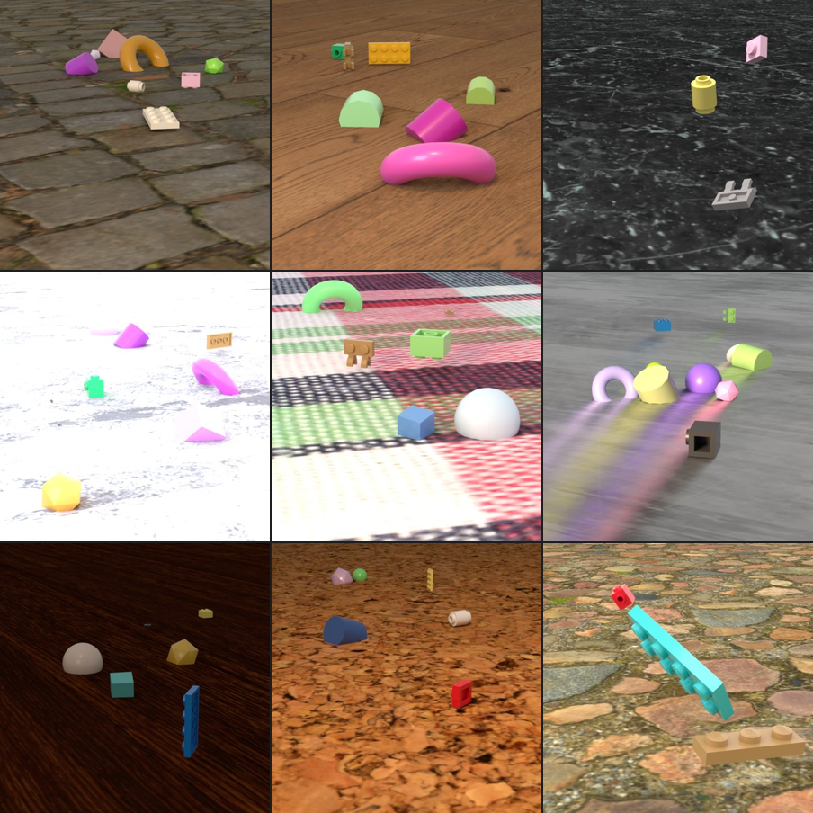

---

## Annotation Pipeline

Annotations are extracted automatically from Cryptomatte AOV renders. Cryptomatte is a VFX industry standard for rendering per-object identity data alongside a beauty image, originally developed for compositing workflows and adopted here for automated annotation extraction. No manual labeling is required. For each scene, Karma XPU produces two outputs in parallel: a beauty PNG for the training image and a Cryptomatte EXR encoding a unique float ID per object instance. A Python extraction script decodes the EXR, builds a binary mask per instance using bitwise ID matching, and converts each mask to a COCO annotation containing a segmentation polygon, bounding box, and area.

This approach replaced an earlier custom SOPs-based RGB mask pipeline that was developed and then superseded before v1 dataset generation began. The RGB approach was limited to 3 instances per scene (one per color channel) and required a separate flat-shaded render pass. Cryptomatte has no instance ceiling, handles partial occlusion natively by storing per-pixel coverage values, and produces pixel-accurate masks without a separate render pass. (See Engineering Decisions for the full technical breakdown of both approaches).

### Beauty PNG and Cryptomatte renders

<table>
  <tr>
    <td align="center">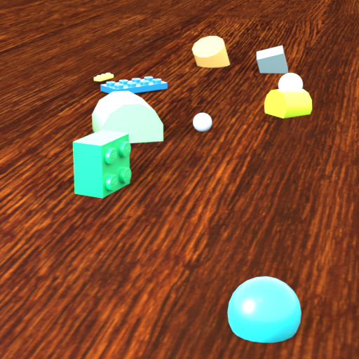 Beauty render</td>
    <td align="center">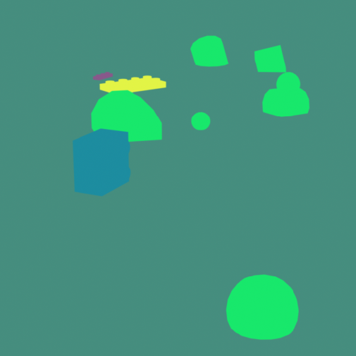 Cryptomatte AOV</td>
    <td align="center">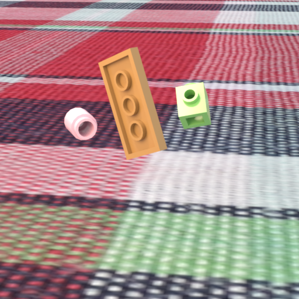 Beauty render</td>
    <td align="center"> Cryptomatte AOV</td>
  </tr>
</table>

### Extracted COCO annotations overlaid on beauty renders

<table>
  <tr>
    <td align="center">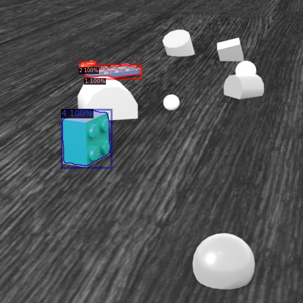 Annotation overlay 1</td>
    <td align="center">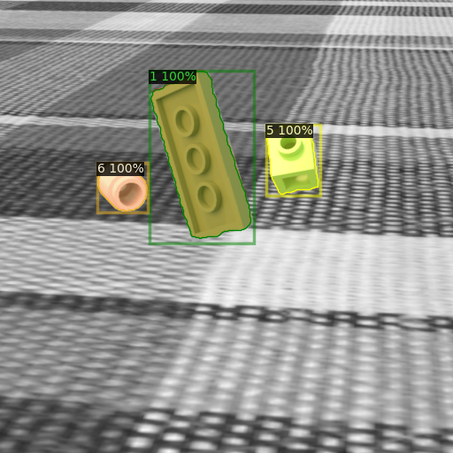 Annotation overlay 2</td>
  </tr>
</table>

### RGB mask pipeline (deprecated)

The original pipeline used RGB masks to encode instance IDs. Shown here for comparison against the Cryptomatte approach.

<table>
  <tr>
    <td align="center">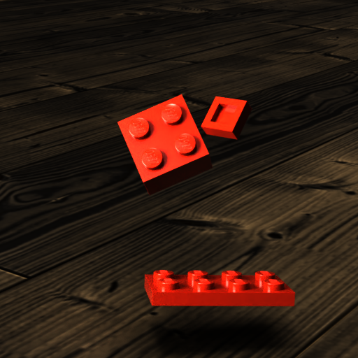 Beauty render</td>
    <td align="center">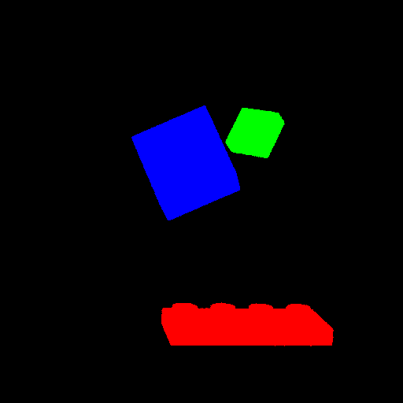 RGB mask render</td>
  </tr>
</table>

---

## Training & Results

The core question this pipeline answers is whether a model fine-tuned exclusively on procedurally generated synthetic data can detect and classify real Lego bricks in uncontrolled environments. The findings reported here are not claimed as novel contributions to the synthetic data literature. Rather, they serve two purposes: validating that this pipeline independently reproduces results consistent with established domain randomization research (Tremblay et al. 2018, Prakash et al. 2019), and demonstrating that a single-developer Houdini-native pipeline built from first principles can achieve sim-to-real transfer on par with the methodologies described in those foundational papers. To answer the core question, four training runs were conducted using Mask R-CNN with a ResNet-50-FPN backbone fine-tuned from COCO-pretrained weights, on an NVIDIA RTX 3090 in WSL2 using Detectron2 0.6 with PyTorch 2.10.0+cu130. Evaluation ground truth was produced via SAM 3-assisted annotation with manual correction in CVAT.

### Class legend

The following class IDs appear as labels in all prediction visualization images:

| ID | Class |
|----|-------|
| 0 | 1x1_plate |
| 1 | 2x4_plate |
| 2 | 1x3_plate |
| 3 | 1x2_plate_with_2_U_Clips |
| 4 | 2x2_brick |
| 5 | 1x1_brick_stud_on_side |
| 6 | 1x1_round_brick |

### Evaluation sets

| Set | Number of Images | Conditions |
|-----|:--------:|------------|
| Controlled | 30 | Single surface, consistent overhead lighting, ~45° camera angle, 1–3 bricks per image |
| Diverse | 60 | Multiple surfaces (kitchen counter, carpet, outdoor concrete, gravel, grass, stainless steel), varied lighting, angles, distances, and background clutter |

---

### Overall results across all four training runs

| Metric | v1 (1-class, 1000 images) | v2 (1-class, 1000 images) | v3 (7-class, 3000 images) | v4 (7-class, 7000 images) |
|--------|:---:|:---:|:---:|:---:|
| **Controlled** | | | | |
| AP@50 (bbox) | 99.9 | 100.0 | 86.1 | 90.6 |
| AP@50:95 (bbox) | 86.8 | 88.2 | 77.9 | 85.4 |
| AP@50 (segm) | 97.9 | 100.0 | 86.1 | 90.6 |
| AP@50:95 (segm) | 88.2 | 90.1 | 77.2 | 82.2 |
| **Diverse** | | | | |
| AP@50 (bbox) | 94.0 | 93.8 | 73.2 | 79.4 |
| AP@50:95 (bbox) | 78.7 | 78.0 | 64.9 | 70.5 |
| AP@50 (segm) | 95.1 | 94.1 | 73.2 | 79.4 |
| AP@50:95 (segm) | 78.5 | 78.5 | 61.9 | 66.7 |

Full COCO evaluation results for all four runs are available in [`assets/results/`](assets/results/).

> **Note on NaN values in the evaluation results summary JSON files:** `APl` (large object AP) shows `NaN` for the controlled evaluation set across all runs. This is expected and correct behavior. The protocol for the controlled eval set was to photograph 1-3 bricks from a consistent distance and angle, producing no instances large enough to meet the COCO large object threshold (bounding box area greater than 96x96 pixels). `NaN` in COCO evaluation indicates no instances of that size existed in the dataset, not a pipeline or model failure. The diverse eval set produces valid `APl` values because varied shooting distances and angles produced some instances that crossed the large object threshold.

| | v1 | v2 | v3 | v4 |
|--|:--:|:--:|:--:|:--:|
| Number of Images | 1,000 | 1,000 | 3,000 | 7,000 |
| Number of Classes | 1 | 1 | 7 | 7 |
| Number of Iterations | 5,000 | 5,000 | 15,000 | 25,000 |
| Training time | ~10 min | ~10 min | ~29 min | ~48 min |
| Final total loss | 0.2602 | 0.2202 | 0.1759 | 0.1818 |
| Distractor Objects | No | Yes | Yes | Yes |

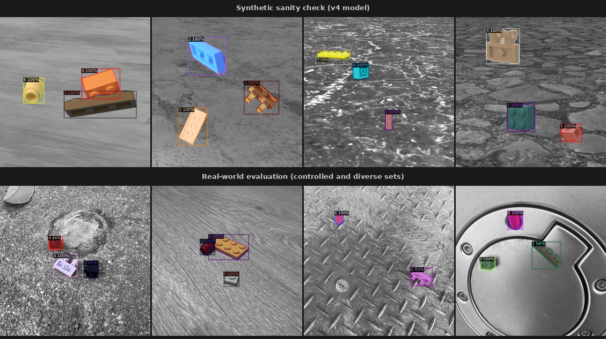

---

### Key findings

- **Synthetic-only training transfers effectively to real photographs.** The v1 baseline (1,000 synthetic images, no distractor objects) was trained in 10 minutes and achieved 94.0 AP@50 on diverse real-world photographs. The pipeline's domain randomization was sufficient to close the sim-to-real gap without any real training data.

- **Distractor objects reduce false positives without hurting overall performance.** The v1 to v2 comparison (adding primitive geometric distractor objects and 13 additional ground textures) showed meaningful qualitative improvement on challenging images: false positives on eval_012 (gravel pavement) dropped from 8 to 3, and eval_037 (scissors and clutter) dropped from 10 to 6. Overall AP@50 held flat across both controlled and diverse sets, and mask precision (AP@50:95 segm) improved by 1.9 points on controlled, confirming that distractors sharpened mask quality without sacrificing detection rate.

- **Multi-class detection is strictly harder than single-class.** The v2 to v3 transition (1-class to 7-class) caused the largest AP drops in the project (controlled AP@50 fell from 100.0 to 86.1, diverse from 93.8 to 73.2). The model now answers two questions simultaneously (detection and classification), and mAP is averaged across classes of varying geometric difficulty.

- **Dataset scale provides meaningful gains for multi-class detection.** Scaling from 3000 to 7000 images (v3 to v4) improved every metric by 4.5–7.5 points. The largest gains were on strict metrics (AP@50:95), indicating more data improves both detection rates and localization precision. Small object AP on diverse jumped from 29.9% to 60.1%.

- **Dataset size requirements are class-dependent.** Geometrically complex classes (1x1_brick_stud_on_side: +38.1 points controlled, v3 to v4) benefit dramatically from more training data. Geometrically simple, distinctive classes (2x4_plate, 2x2_brick) show diminishing returns at 3000 images. This has direct implications for data budgeting in industrial synthetic data pipelines.

---

### v3 per-class results (7-class, 3,000 images)

**Class distribution (3,000 images, balance ratio 1.08x):**

| Class | Instances | % |
|-------|:---------:|:---:|
| 1x1_plate | 1,222 | 13.7% |
| 2x4_plate | 1,239 | 13.8% |
| 1x3_plate | 1,273 | 14.2% |
| 1x2_plate_with_2_U_Clips | 1,280 | 14.3% |
| 2x2_brick | 1,318 | 14.7% |
| 1x1_brick_stud_on_side | 1,317 | 14.7% |
| 1x1_round_brick | 1,298 | 14.5% |
| **Total** | **8,947** | |

**AP@50:95 (bbox):**

| Class | Controlled | Diverse |
|-------|:---:|:---:|
| 2x2_brick | 96.0 | 69.1 |
| 2x4_plate | 94.5 | 74.8 |
| 1x1_round_brick | 89.7 | 68.4 |
| 1x1_plate | 77.5 | 69.9 |
| 1x2_plate_with_2_U_Clips | 77.3 | 64.3 |
| 1x3_plate | 74.9 | 53.8 |
| 1x1_brick_stud_on_side | 35.6 | 54.2 |

**AP@50:95 (segmentation):**

| Class | Controlled | Diverse |
|-------|:---:|:---:|
| 2x2_brick | 93.9 | 67.5 |
| 2x4_plate | 92.7 | 73.5 |
| 1x1_round_brick | 91.4 | 66.2 |
| 1x1_plate | 80.6 | 65.3 |
| 1x2_plate_with_2_U_Clips | 74.2 | 58.2 |
| 1x3_plate | 71.9 | 50.8 |
| 1x1_brick_stud_on_side | 35.6 | 51.7 |

---

### v4 per-class results (7-class, 7,000 images)

**Class distribution (7,000 images, balance ratio 1.04x):**

| Class | Instances | % |
|-------|:---------:|:---:|
| 1x1_plate | 2,924 | 14.0% |
| 2x4_plate | 2,955 | 14.1% |
| 1x3_plate | 3,020 | 14.5% |
| 1x2_plate_with_2_U_Clips | 2,962 | 14.2% |
| 2x2_brick | 3,033 | 14.5% |
| 1x1_brick_stud_on_side | 3,041 | 14.6% |
| 1x1_round_brick | 2,961 | 14.2% |
| **Total** | **20,896** | |

**AP@50:95 (bbox):**

| Class | Controlled | Diverse | Gap |
|-------|:---:|:---:|:---:|
| 2x2_brick | 98.5 | 64.5 | -34.0 |
| 2x4_plate | 96.2 | 79.0 | -17.2 |
| 1x1_round_brick | 91.1 | 78.0 | -13.1 |
| 1x2_plate_with_2_U_Clips | 88.3 | 75.3 | -13.0 |
| 1x1_plate | 79.9 | 75.7 | -4.2 |
| 1x1_brick_stud_on_side | 73.7 | 65.2 | -8.5 |
| 1x3_plate | 70.2 | 56.1 | -14.1 |

**AP@50:95 (segmentation):**

| Class | Controlled | Diverse | Gap |
|-------|:---:|:---:|:---:|
| 2x4_plate | 93.1 | 75.1 | -18.0 |
| 2x2_brick | 93.1 | 63.5 | -29.6 |
| 1x1_round_brick | 92.1 | 73.4 | -18.7 |
| 1x2_plate_with_2_U_Clips | 82.5 | 64.3 | -18.2 |
| 1x1_plate | 75.0 | 71.4 | -3.6 |
| 1x1_brick_stud_on_side | 72.4 | 65.1 | -7.3 |
| 1x3_plate | 67.4 | 54.0 | -13.4 |

---

### v3 to v4 per-class scaling (AP@50:95 bbox)

| Class | v3 Controlled | v4 Controlled | Delta | v3 Diverse | v4 Diverse | Delta |
|-------|:---:|:---:|:---:|:---:|:---:|:---:|
| 1x1_brick_stud_on_side | 35.6 | 73.7 | +38.1 | 54.2 | 65.2 | +11.0 |
| 1x2_plate_with_2_U_Clips | 77.3 | 88.3 | +11.0 | 64.3 | 75.3 | +11.0 |
| 1x1_round_brick | 89.7 | 91.1 | +1.4 | 68.4 | 78.0 | +9.6 |
| 1x1_plate | 77.5 | 79.9 | +2.4 | 69.9 | 75.7 | +5.8 |
| 2x4_plate | 94.5 | 96.2 | +1.7 | 74.8 | 79.0 | +4.2 |
| 1x3_plate | 74.9 | 70.2 | -4.7 | 53.8 | 56.1 | +2.3 |
| 2x2_brick | 96.0 | 98.5 | +2.5 | 69.1 | 64.5 | -4.6 |

The gains from dataset scaling are not uniform across classes. Geometrically complex classes benefit most: 1x1_brick_stud_on_side went from essentially broken (35.6) to functional (73.7) with approximately 1,750 additional instances across 4,000 additional images. Classes that were already well-learned at 3000 images (2x4_plate at 94.5, 2x2_brick at 96.0) showed minimal additional gains on controlled (classic diminishing returns for objects with simple, distinctive geometry). The 1x3_plate showed a slight regression on controlled (-4.7) while improving on diverse (+2.3), suggesting the larger dataset introduced more viewpoint ambiguity with the visually similar 2x4_plate on clean backgrounds while still improving real-world generalization.

---

### Failure modes

Three distinct failure patterns were identified across all training runs.

#### Pattern 1: Background false positives

The model detects non-Lego elements in the background as Lego bricks: gravel rocks, concrete cracks, water drops, shadows, and embossed letters.

Most severe in v1 (no distractors). The root cause is insufficient negative examples in training: the model learned "small colorful region on a surface = Lego brick" without learning what is not a Lego brick. Adding primitive geometric distractors in v2 reduced eval_012 false positives from 8 to 3. Scaling to 7000 images in v4 further reduced false positives across all affected images.

<table>
  <tr>
    <td align="center">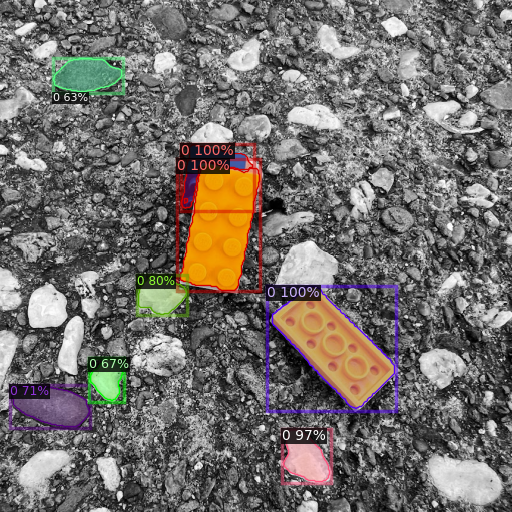 v1: 8 false positives on gravel</td>
    <td align="center">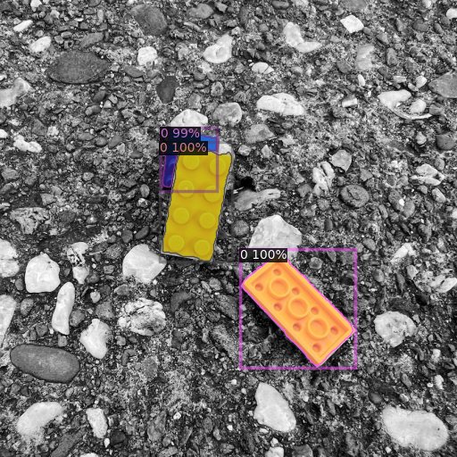 v2: 3 false positives after distractor objects added</td>
  </tr>
</table>

Proposed fixes: more diverse distractor geometry (household objects, irregular shapes rather than only geometric primitives), more coarse-textured ground materials (gravel, rough concrete, patterned fabric), post-processing noise and blur augmentation.

#### Pattern 2: Double-labeling and class confusion (7-class only)

The model correctly detects a brick but assigns it two different class labels simultaneously, producing overlapping detections of different classes on the same object.

Common confusions observed:
- 1x1_brick_stud_on_side detected as also being a 2x2_brick (both are roughly cubic from certain angles)
- 1x3_plate detected as also being a 2x4_plate (both are flat rectangular plates)
- 1x2_plate_with_2_U_Clips detected as also being a 2x4_plate (clip arms extend the silhouette)
- 1x1_plate detected as also being a 1x1_brick_stud_on_side (small objects with ambiguous shape)

The root cause is viewpoint ambiguity; from certain angles, different brick types produce similar silhouettes. The model outputs both class predictions above the 0.5 confidence threshold because the visual features genuinely match both classes. This pattern persists from v3 to v4 (eval_020 shows the same double-labeling in both runs), confirming that more data alone does not resolve geometrically ambiguous cases.

<table>
  <tr>
    <td align="center">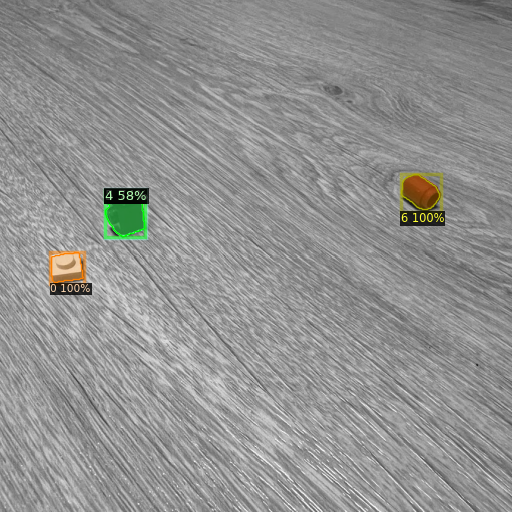 v3: 1x1_brick_stud_on_side (5) double-labeled as 2x2_brick (4)</td>
    <td align="center">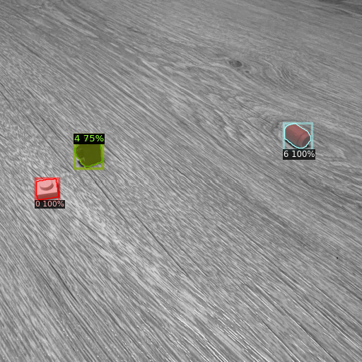 v4: same double-labeling persists with 7K images</td>
  </tr>
</table>

Proposed fixes: NMS (Non-Maximum Suppression, the standard post-processing step that eliminates duplicate bounding boxes by suppressing lower-confidence detections that significantly overlap higher-confidence ones) threshold tuning to merge overlapping detections of different classes, a post-processing step to suppress detections that overlap more than 80% IoU (Intersection over Union, a measure of how much two bounding boxes overlap) with a higher-confidence detection of a different class, and more diverse training viewpoints to provide stronger class-discriminating features from all angles.

#### Pattern 3: Occlusion-induced detection splitting (7-class only)

A partially occluded brick is split into two or more separate detections, each covering a disconnected visible segment.

The most affected class is 2x2_brick, which has the largest controlled-to-diverse gap at 34 points. Despite scoring 98.5 AP on controlled, it drops to 64.5 on diverse. Key example: eval_058 shows a 2x2_brick partially occluded by another brick, with two unconnected visible segments each detected as separate objects. The 1x2_plate_with_2_U_Clips is also affected. Its protruding clip arms visually disconnect from the main plate body at certain angles, causing the model to detect clips and body as separate bricks.

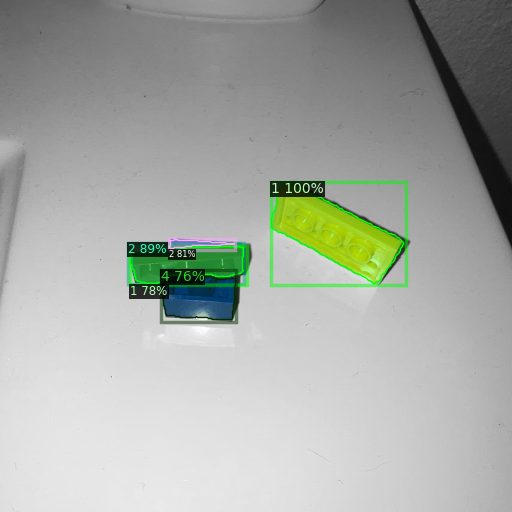

The root cause is limited training exposure to heavy occlusion scenarios where a single object produces disconnected visible segments.

Proposed fixes: increased partial occlusion variety in training data, more images with 4–5 bricks per scene to increase occlusion probability, a more robust placement algorithm that explicitly controls separation distances per placement mode to increase occlusion frequency in a more structured way, and training with Mask R-CNN's `iscrowd` flag, which marks heavily overlapping instances for special handling during training. Note that the original RGB mask pipeline included support for the `iscrowd` flag to handle heavily overlapping instances where individual masks were ambiguous, but this was not carried forward into the Cryptomatte pipeline and represents a known gap to address in a future iteration.

---

### Inference examples

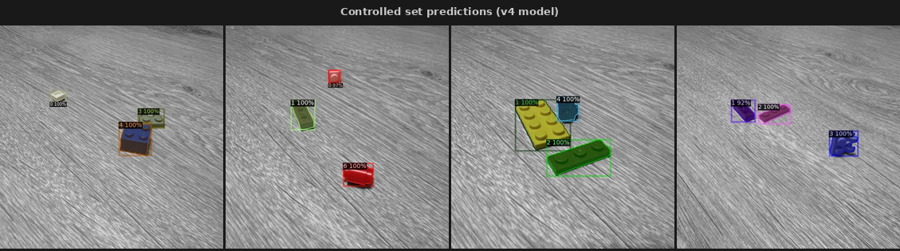
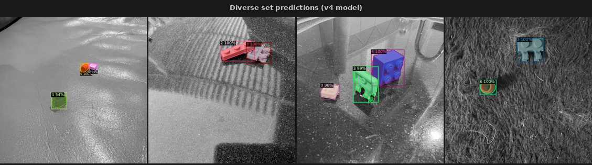

---

## Engineering Decisions

### The original RGB mask approach (deprecated)

This section documents the original annotation approach (v0), replaced by Cryptomatte before the first formal training run. The engineering is included because it directly informed the Cryptomatte implementation.

Before Cryptomatte, annotation extraction was built entirely inside Houdini's SOP context using a geometry-native approach to a problem most pipelines solve in image processing.

The pipeline rendered two passes per scene from a fixed camera: a beauty PNG and a flat-shaded mask render where each Lego brick was assigned a unique solid color: red, green, or blue. A second camera and material network drove this mask render, with all scene materials replaced by flat color shaders assigned per instance.

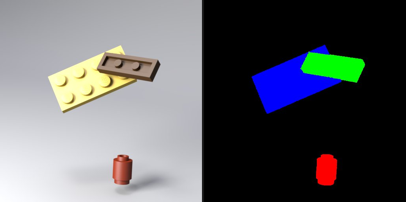

To extract segmentation contours from the mask render, the pipeline treated the 512×512 image as a grid of 262,144 points in Houdini (one point per pixel). Red, green, and blue pixel regions corresponded to each of the three brick instances. Extracting a segmentation polygon from a discrete point cloud is not straightforward: you have a scattered set of colored points with no inherent boundary, and COCO format requires an ordered polygon tracing the instance outline.

The solution was a geometry-native equivalent of a Minkowski sum. Each colored pixel-point was expanded into a small circle (a copy of a disc geometry placed at each point), and all overlapping circles were fused into a single continuous mesh. This converted a discrete point cloud into a solid shape with a well-defined, traceable boundary, without any neighbor-checking or contour-ordering logic. In plain terms: instead of checking whether each pixel is on an edge by examining its neighbors one at a time, the pipeline gave every pixel a small area and merged them all together, creating a shape whose boundary is automatically the outline we needed.

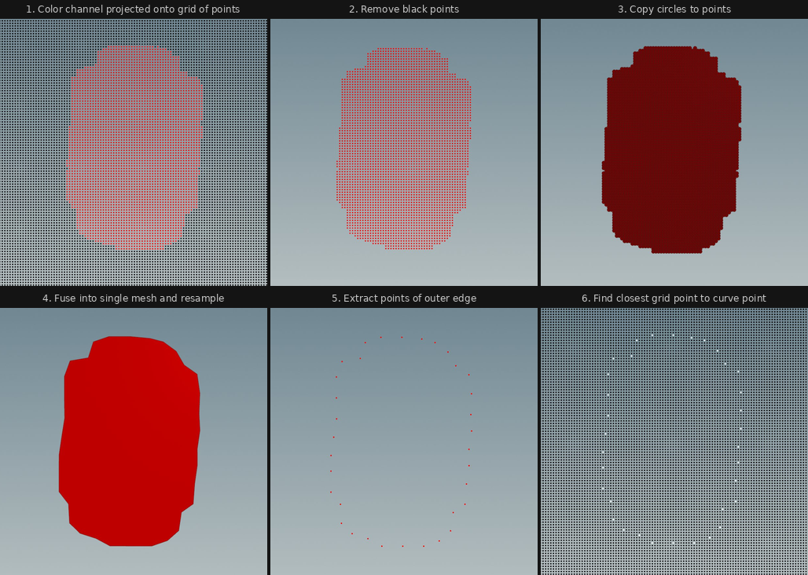

The `mask_pixel_processing` SOP network handled the full annotation extraction: bounding box coordinates were read directly from the axis-aligned bounding box of each color region, segmentation polygon vertices came from the silhouette extraction, area was computed from point count, and the `is_crowd` flag was set for instances where occlusion produced disjoint silhouette segments (handled by splitting disconnected regions into separate groups via connectivity analysis before extraction).

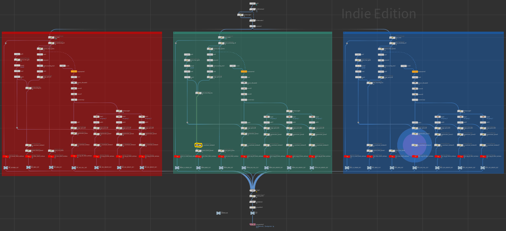

The result was a complete COCO annotation (bounding box, segmentation polygon, area, and is_crowd) extracted entirely through procedural geometry operations with no Python or image processing libraries.

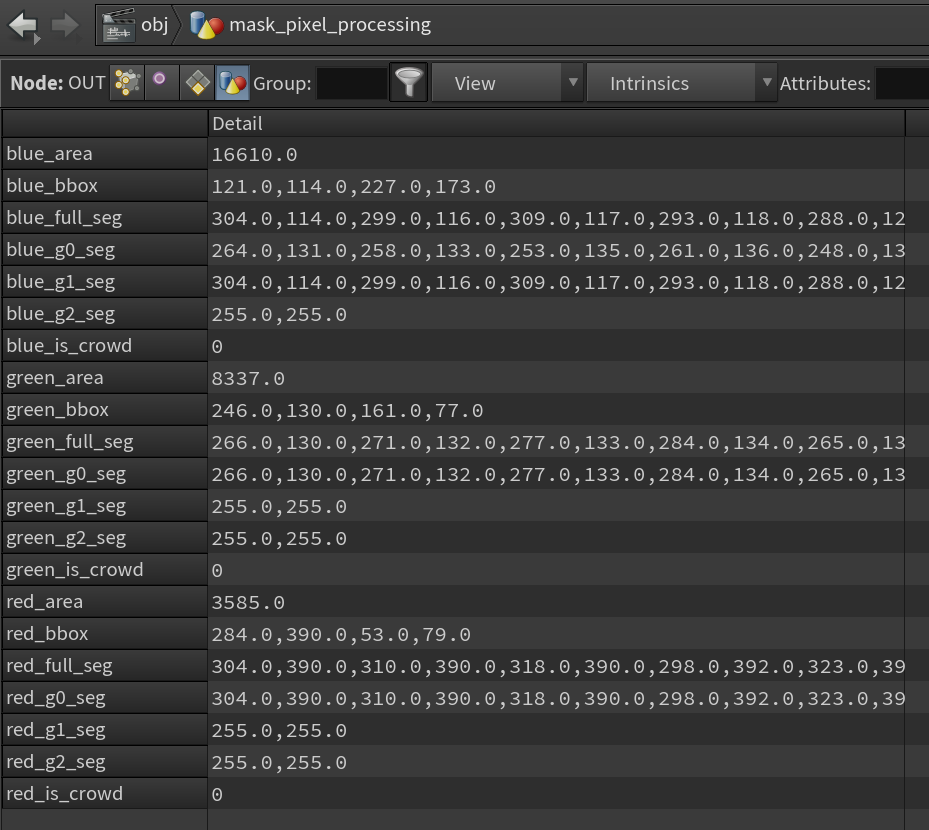

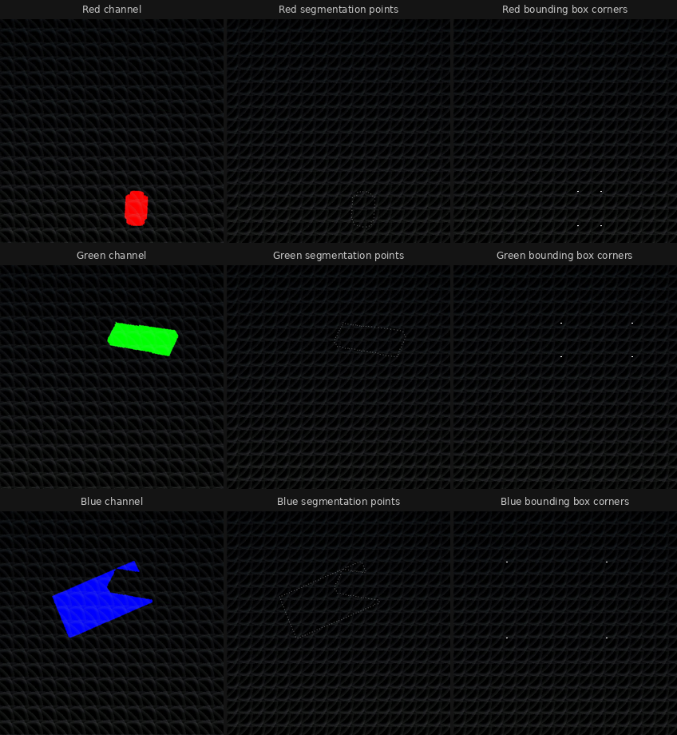

  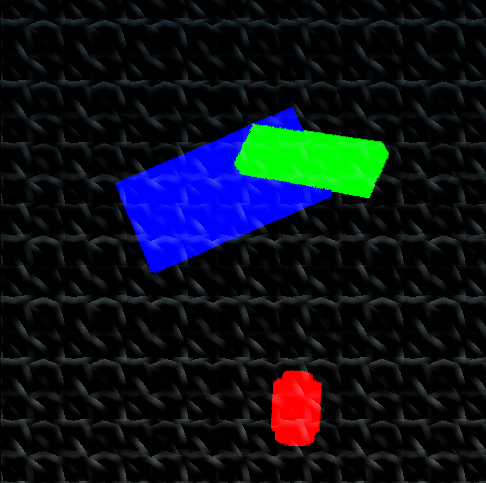

The approach worked and produced correct annotations, but had two fundamental limitations. First, it was hard-capped at 3 object instances per scene (one per color channel). Encoding more instances would require multi-channel color encoding with respect to `is_crowd` for every instance that was partially occluded. This would have taken much more time and engineering investment to scale up to work on an arbitrary amount of instances in the scene. Second, it required a separate flat-shaded render pass with its own camera and material network, doubling render overhead per scene.

The Cryptomatte refactor eliminated both limitations. The geometry-native approach was kept as the basis for understanding what annotation extraction actually needs to do. And that understanding made writing the Python replacement straightforward.

### Why Cryptomatte over RGB masks

Cryptomatte eliminated both limitations of the RGB approach in a single architectural change.

Karma XPU renders the Cryptomatte AOV as part of the beauty pass with no second render needed. Each object instance is assigned a unique float32 ID derived from its USD prim path (the unique scene graph address of each object in the Solaris stage), stored per-pixel alongside a coverage value. The extraction script decodes the EXR, performs bitwise ID matching against the manifest, and builds a binary mask per instance using a 0.5 coverage threshold to handle antialiased edges. There is no instance ceiling; the pipeline handles 2 bricks per scene and 10 bricks per scene identically. Partial occlusion is handled natively: disconnected visible segments of the same object share the same Cryptomatte ID, so the annotation correctly captures the full instance across disjoint regions.

The migration also unlocked the 7-class scale-up. With RGB masks, per-class annotation required encoding class IDs into color values (a fragile approach that would break down across 7 classes). With Cryptomatte, class assignment comes from the USD prim path itself via a `Lego_` geometry name prefix filter and a category ID map, making multi-class annotation a metadata lookup rather than a pixel encoding problem.

---

### Why point pool depletion over for-each feedback loops

The original intersection avoidance approach used a for-each feedback loop with an `intersectionanalysis` SOP. For each brick placement, the loop checked all previously placed bricks for intersections and rejected candidates that overlapped. This was correct in theory, but the `intersectionanalysis` SOP alone consumed 0.105s of a 0.110s total cook time. With 3 bricks per scene across thousands of wedge iterations, that single node was 95% of all SOP compute.

The deeper problem was scaling behavior. The for-each feedback loop runs `intersectionanalysis` once per iteration, and intersection analysis cost grows with scene complexity. For 3 bricks it was slow. For 10 bricks it would have been unacceptable.

The refactor replaced the entire loop with a single VEX attribute wrangle implementing point pool depletion. The logic is O(n) and runs entirely in VEX:

1. Scatter candidate points across the placement volume
2. Pick a random candidate, record the placement
3. Deplete all candidate points within `min_separation_distance` using `nearpoints()`
4. Repeat for each remaining piece

Before point pool depletion runs, candidate points are pre-filtered by a camera frustum culling step. A frustum culling subnetwork projects each candidate point into normalized device coordinates (a coordinate system where 0-1 represents the camera's visible area) and removes any point that falls outside the camera's visible range, sits below the ground plane, or exceeds a maximum distance threshold. This ensures the placement pool only contains positions that will actually be visible in the render. Two separate frustum culling subnetworks handle the ground and floating placement branches independently.

The result is a placement system with no feedback loop, no `intersectionanalysis` SOP, and no iterative geometry evaluation. The SOP brick placement network cooks in under 0.001s (a ~110x speedup on the actual placement logic) and the cost stays near-instant regardless of piece count because `nearpoints()` uses a spatial acceleration structure internally.

The `min_separation_distance` parameter is exposed as a wedge-able attribute, making occlusion density a controllable domain randomization axis rather than a fixed constraint.

**Old network: for-each feedback loop with intersectionanalysis:**

<table>
  <tr>
    <td align="center">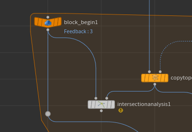 Old brick placement network: for-each loop with intersection analysis</td>
    <td align="center">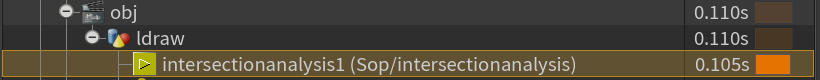 Old cook time: intersectionanalysis consuming 95% of cook time</td>
  </tr>
</table>

**New network: point pool depletion in a single VEX wrangle:**

<table>
  <tr>
    <td align="center">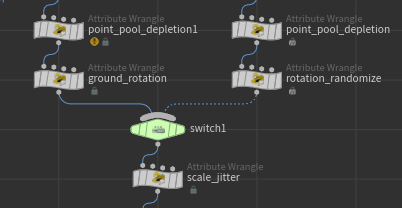 New brick placement network: point pool depletion</td>
    <td align="center">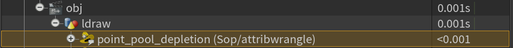 New cook time: under 0.001s</td>
  </tr>
</table>

---

### Why Karma XPU

Karma XPU is Houdini's native USD/Solaris renderer with full GPU acceleration. The choice was straightforward for three reasons.

First, native Cryptomatte AOV support. Karma XPU outputs Cryptomatte channels as part of the standard render product setup in Solaris. This requires no plugins, no workarounds, and no post-process compositing step. The manifest and pixel data are written directly to the EXR. Any third-party renderer would have required either a Cryptomatte plugin or a custom AOV pipeline.

Second, GPU acceleration on the RTX 3090. Karma XPU rendered 512×512 scenes in roughly 8-9 seconds per frame depending on scene complexity, making a 7,000-image dataset generation feasible in under 17 hours on a single consumer GPU. A CPU renderer at equivalent quality settings would have been impractical at this scale.

Third, native integration with the Solaris USD pipeline. All material assignments, lighting rigs, HDRI domes, and camera setups live in the USD stage and are read directly by Karma without any translation layer. Adding a third-party renderer would have required a translation step between the USD scene graph and the renderer's native scene format, adding pipeline complexity.

---

### Training configuration

The training configuration follows established practices from the domain randomization literature and Detectron2's own documented defaults, rather than arbitrary choices.

**Architecture:** Mask R-CNN with ResNet-50-FPN was selected because it is the standard baseline used in the foundational DR papers (Tremblay et al. 2018, Prakash et al. 2019), making results directly comparable to the literature.

**COCO pretraining:** Transfer learning from COCO-pretrained weights is standard practice in synthetic data pipelines. Tremblay et al. (2018) explicitly use ImageNet/COCO pretraining before fine-tuning on synthetic data. The backbone's existing knowledge of edges, textures, and shapes reduces the training data required to achieve strong performance.

**Learning rate (0.0025):** Derived from Detectron2's default Mask R-CNN configuration (BASE_LR: 0.02 at batch size 16) using the linear scaling rule from Goyal et al. (2017): 0.02 × (2/16) = 0.0025.

**Iterations:** Calibrated for approximately 7–10 epochs per run. One epoch equals dataset size divided by batch size = 500 iterations per epoch at 1000 images and 3,500 iterations at 7000 images. Detectron2's default schedules are designed for COCO's 118,000 images and were scaled proportionally to each dataset size.

**LR decay steps at 70% and 90% of training:** A variant of the standard step decay schedule used in Detectron2's 3x config, with decay applied later to allow longer training at the full learning rate before reduction (appropriate for smaller datasets).

**Batch size 2:** A hardware constraint. Mask R-CNN with ResNet-50-FPN at 512×512 fits batch size 2 comfortably on a single 24GB GPU. Detectron2's documentation explicitly covers single-GPU training at this batch size as a standard configuration.

**Image resolution 512×512:** Consistent with Tremblay et al. (2018), who used 512×512 in their synthetic data experiments, and sufficient to resolve the geometric detail needed for 7-class brick classification.

---

## Dataset

The synthetic datasets generated by this pipeline are publicly available on Hugging Face. All four training versions are published separately to document the full iterative development process.

| Version | Number of Images | Number of Classes | Description |
|:---------:|:--------:|:---------:|-------------|
| v1 | 1,000 | 1 | Baseline: no distractor objects, 29 domain randomization axes |
| v2 | 1,000 | 1 | Distractor objects across 3 domain randomization axes added (bringing total axes from 29 to 32), 13 additional textures |
| v3 | 3,000 | 7 | 7-class scale-up |
| v4 | 7,000 | 7 | Full-scale primary dataset |

Each version includes:
- 512×512 PNG renders
- COCO-format annotations JSON (bounding boxes + instance segmentation masks)

**Dataset:** [nathankimnguyen412/houdini-lego-sdg](https://huggingface.co/datasets/nathankimnguyen412/houdini-lego-sdg)

**License:** The synthetic dataset is released under [CC BY 4.0](LICENSE). The generation pipeline is proprietary.

**Citation:** See [CITATION.cff](CITATION.cff)

---

## Training Code

The Detectron2 training and evaluation scripts are in [`/training`](training/).

---

## Next Steps

- [ ] Domain randomization ablation study: isolate each axis and measure its individual contribution to real-world AP, identifying which axes drive the most sim-to-real transfer and which are negligible
- [ ] Render farm integration: connect TOPs/PDG to a cloud render farm supporting Karma XPU (such as Fox Renderfarm, GarageFarm, or GridMarkets) to break past the single-GPU bottleneck of local dataset generation.
- [ ] Rebalance HDRI distribution toward lower-exposure and night/dim environments to improve generalization under challenging lighting conditions
- [ ] NMS threshold tuning to address double-labeling and class confusion failure pattern
- [ ] Expanded distractor object library: household objects and irregular shapes to replace primitive geometric distractors
- [ ] Increased occlusion variety: more images with 4–5 bricks per scene to address occlusion-induced detection splitting
- [ ] COPs augmentation pipeline: integrate Houdini's COPs context as a post-rendering augmentation stage to apply image-space effects including lens distortion, sensor noise, chromatic aberration, color grading, and geometric transforms simultaneously to beauty renders and Cryptomatte AOVs, closing the sim-to-real appearance gap with minimal additional processing cost compared to rendering and keeping annotations perfectly aligned with augmented outputs
- [ ] HDA packaging: wrap the full pipeline into a distributable Houdini toolkit across five layers: a SOP HDA for scene assembly and brick placement, a LOP HDA for the Solaris stage (materials, lighting, camera, Karma render settings), a TOP HDA for PDG batch orchestration with exposed domain randomization axis controls and wedge parameters, a COP HDA for post-rendering augmentation, and a standardized asset pack folder structure using environment variable paths so the toolkit is portable across machines. Full distributable release on GitHub with install instructions.
- [ ] Multi-object dataset generation: the pipeline is already object-agnostic at the architecture level, meaning any 3D mesh or USD asset can be substituted as the target geometry without pipeline-level changes. A planned next step is to apply this to additional object categories beyond Lego bricks, targeting domains with high synthetic data demand such as industrial parts, robotic manipulation targets, and household objects for embodied AI training.
- [ ] Synthetic sensor data generation: extend the pipeline beyond images to produce paired LiDAR point clouds, depth maps, and surface normal maps from the same Houdini scenes, enabling multi-modal perception model training from a single procedural source
- [ ] Cross-domain pipeline applications: apply the procedural generation architecture to additional synthetic data modalities beyond object detection, including diffusion model style transfer from low-poly renders to photorealistic images for scalable dataset augmentation, Gaussian splat generation from procedurally placed and randomized scenes for novel view synthesis and 3D reconstruction training, and export to additional 3D primitives and scene formats (USD, NeRF, point clouds) to serve downstream perception and simulation pipelines
- [ ] Agentic domain randomization optimization: apply an autoresearch-style autonomous experiment loop to the data generation layer, where an agent iteratively modifies domain randomization parameters, generates small proxy datasets, fine-tunes lightweight models, evaluates AP on the real-world eval set, and iterates overnight. This extends Andrej Karpathy's [autoresearch](https://github.com/karpathy/autoresearch) pattern from model training code to the upstream synthetic data pipeline, treating domain randomization configuration as the optimization target rather than neural network architecture.

---

## References

- Tremblay et al. (2018). "Training Deep Networks with Synthetic Data: Bridging the Reality Gap by Domain Randomization." CVPR Workshop. [arXiv:1804.06516](https://arxiv.org/abs/1804.06516)
- Prakash et al. (2019). "Structured Domain Randomization: Bridging the Reality Gap by Context-Aware Synthetic Data." ICRA. [arXiv:1810.10093](https://arxiv.org/abs/1810.10093)
- Goyal et al. (2017). "Accurate, Large Minibatch SGD: Training ImageNet in 1 Hour." [arXiv:1706.02677](https://arxiv.org/abs/1706.02677)
- He et al. (2019). "Rethinking ImageNet Pre-Training." ICCV. [arXiv:1811.08883](https://arxiv.org/abs/1811.08883)
- Wu et al. (2019). "Detectron2." Facebook AI Research. [GitHub](https://github.com/facebookresearch/detectron2)
- LDraw.org. "LDraw™ is an open standard for LEGO CAD programs" [ldraw.org](https://www.ldraw.org)

---

## About

Built by [Nathan Nguyen](https://github.com/nathankimnguyen412) — a pipeline engineer with nearly a decade of experience in content generation pipelines, procedural generation, and Houdini — transitioning into synthetic data generation and robotics simulation.

I am actively seeking pipeline engineering roles focused on synthetic data, embodied AI, and simulation. I am also open to research engineering collaborations, particularly in areas where procedural generation, domain randomization, and multi-modal sensor data intersect.

[LinkedIn](https://www.linkedin.com/in/nathanknguyen) | [GitHub](https://github.com/nathankimnguyen412) | [Datasets on Hugging Face](https://huggingface.co/datasets/nathankimnguyen412/houdini-lego-sdg)